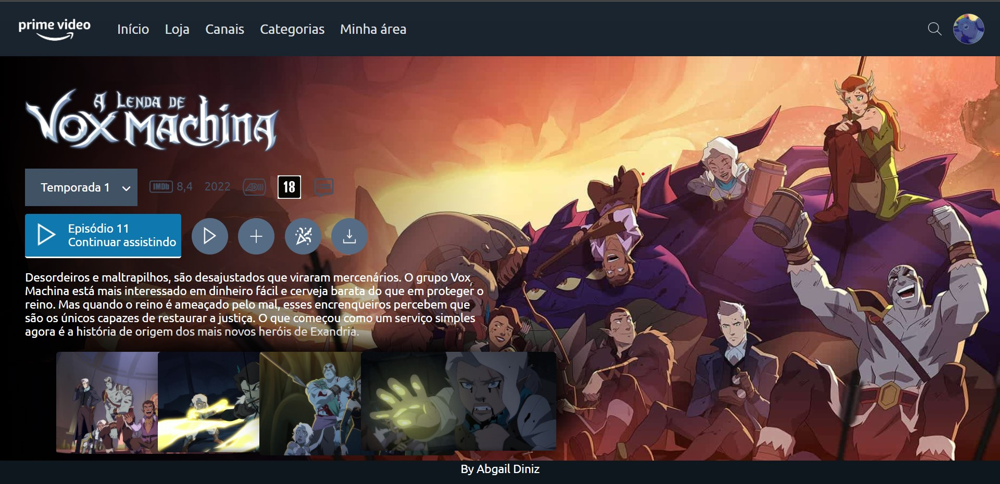
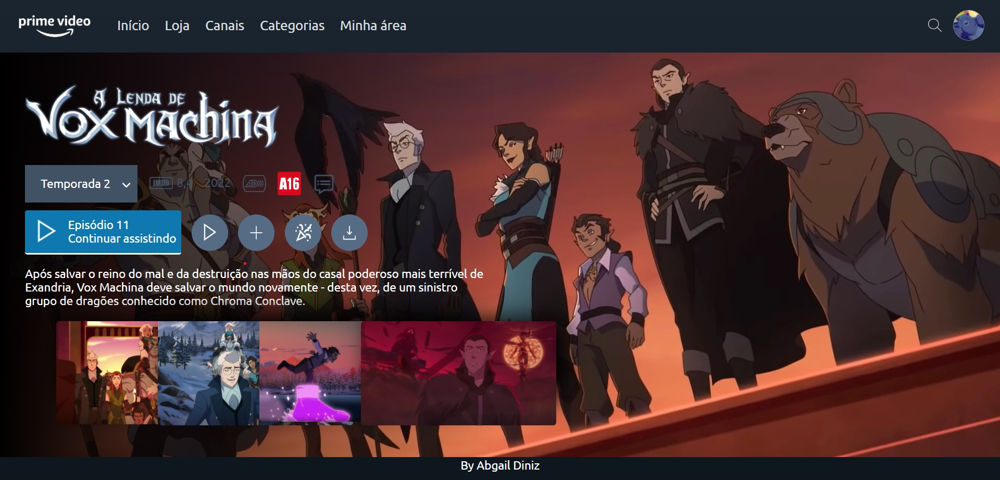
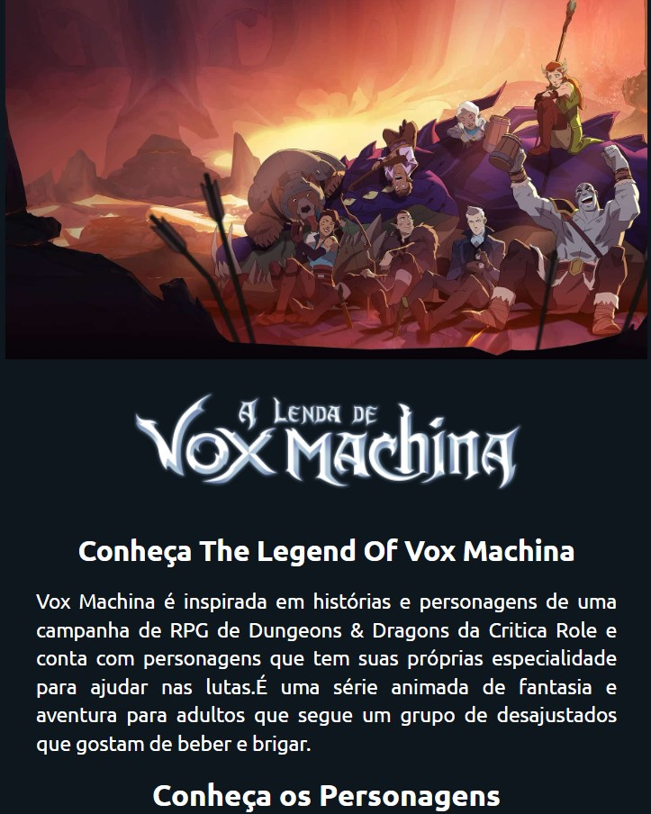

<h1 align="center">🍿Projeto Landing Page do Prime Video </h1>

## 💻 Projeto

O projeto é a reprodução do site do prime video da serie the legend of vox machina que é original da streaming. Quando selecionado a temporada o fundo, as imagens dos blocos se alteram como o trailer quando clicado em continuar assistindo.  

- [Visite o projeto online](https://abgail-diniz.github.io/page.prime.video/)

 
<h3>▶️ Primeira Temporada</h3>

<h3>⏩ Segunda Temporada</h3>

<h3>⏸ Mobile</h3>

 

## 🚀 Tecnologias

Esse projeto foi desenvolvido com as seguintes tecnologias:

- HTML  
- CSS
- JavaScript

___

By Abgail Diniz 

